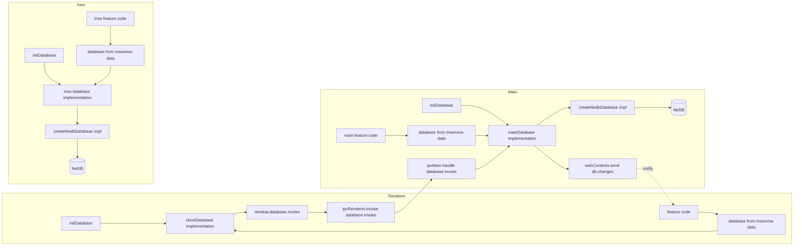
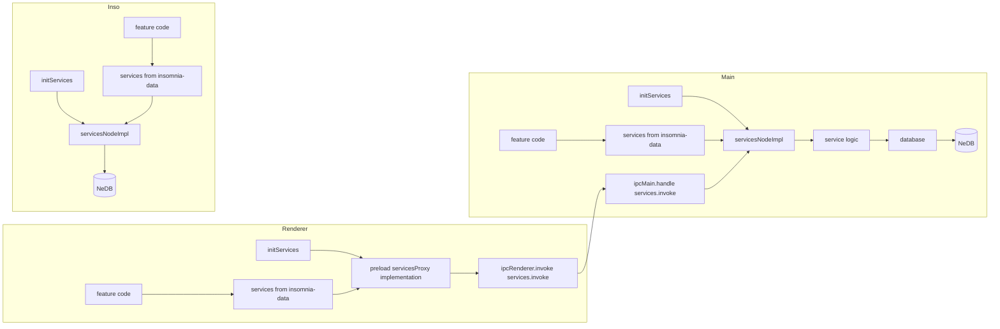

# insomnia-data

A runtime-agnostic data layer for Iusomnia, based on interface + IoC.

## Core idea

- `src/`: runtime-agnostic contracts (`IDatabase`, `Services`, model metadata/types)
- `node-src/`: Node/main concrete implementations (`createNedbDatabase`, `servicesNodeImpl`)
- entry points wire once:
  - `initDatabase(impl)`
  - `initServices(impl)`

After wiring, business code always uses the same APIs: `database`, `services`, `models`.

## Process flows

### Database (main / renderer / inso)



### Services (main / renderer / inso)



Renderer services path:

`services.xxx` -> preload proxy -> IPC -> main handler -> `servicesNodeImpl` -> database.

## Why this design

- Same API across runtimes: main, renderer, inso.
- Feature code is decoupled from Electron/IPC/NeDB details.
- Renderer has a safer boundary (bridge + IPC, no direct DB internals and node API access).
- Easy to test or swap implementations by injecting at startup.

## Minimal usage

### Main

```ts
import { initDatabase, initServices } from '~/insomnia-data';
import { mainDatabase } from '~/main/database.main';
import { servicesNodeImpl } from '~/insomnia-data/node';

await initDatabase(mainDatabase);
initServices(servicesNodeImpl);
```

### Renderer

```ts
import { initDatabase, initServices } from '~/insomnia-data';
import { clientDatabase } from '~/ui/database.client';

await initDatabase(clientDatabase);
initServices(window._dataServices);
```

### Inso / Node

```ts
import { initDatabase, initServices } from '~/insomnia-data';
import { createNedbDatabase, servicesNodeImpl } from '~/insomnia-data/node';

await initDatabase(createNedbDatabase());
initServices(servicesNodeImpl);
```

### Consuming

```ts
import { services, models, type Request } from '~/insomnia-data';

const mcpRequest = await services.mcpRequest.create({ url: 'http://localhost:3000' });
const all = await services.mcpRequest.all();

const request: Request = {};

const requestType = models.request.type;
```
